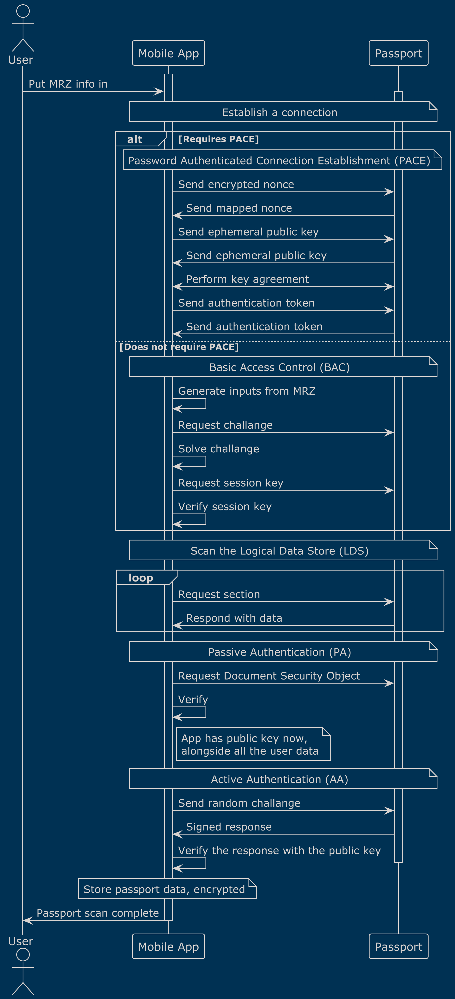
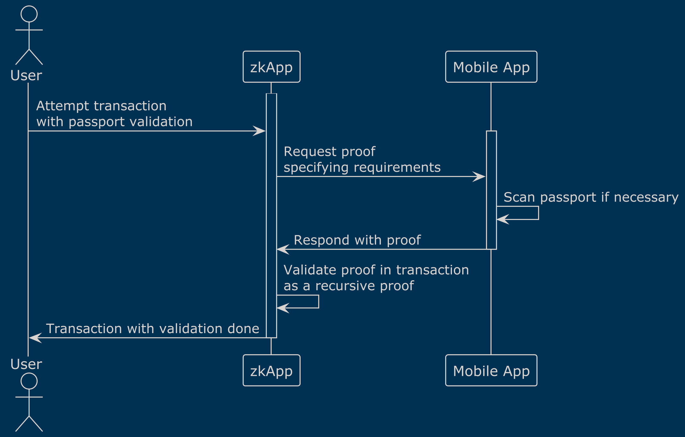
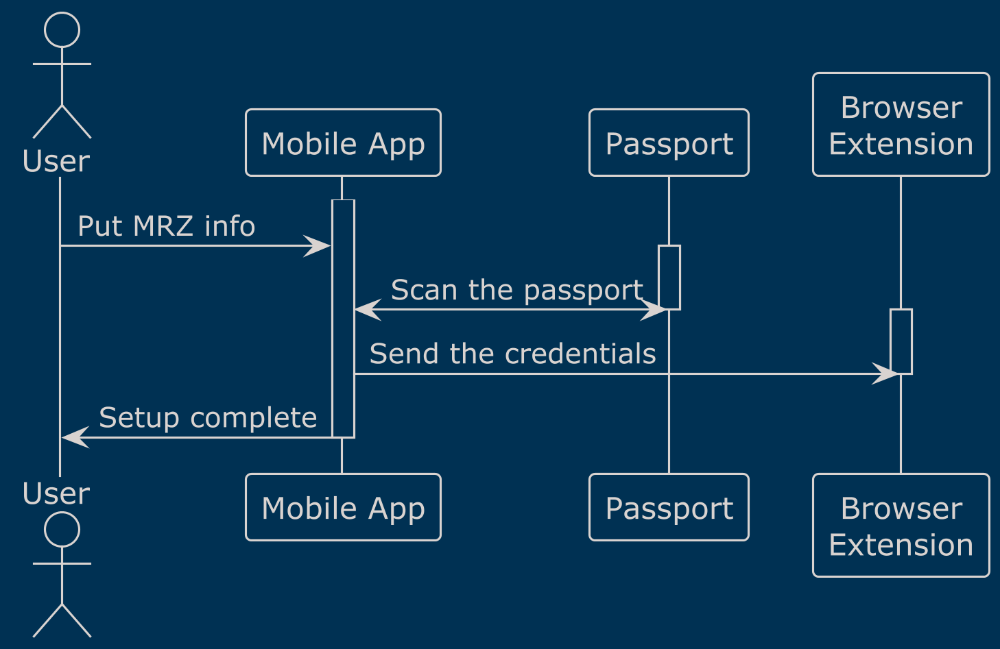
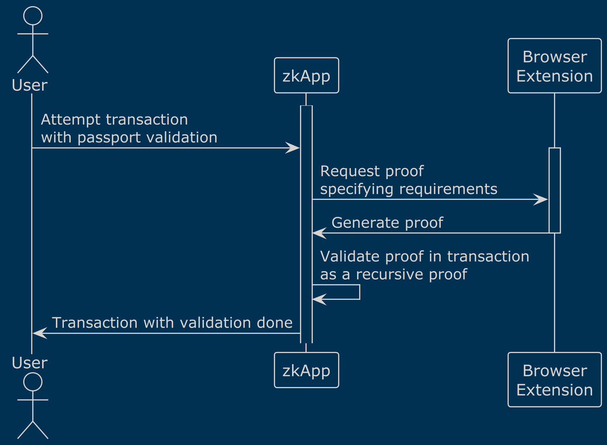

RFP: Going Mobile with ZkPassport

## Overview
The aim of this proposal is setting the standard of creating identity proofs to be used in Mina transactions, and providing tooling for this purpose.

Passports already containing verifiable credentials for the individual, cryptographically signed by the issuing authorities (countries), allows the possibility for a zk layer to depend upon.

We propose building a system such that:
1. User will scan their passports, using their mobile phone with NFC capabilities, using a mobile application.
2. zkApp developers will request an identity proof, satisfying certain conditions, such that being over a certain age or belonging to a certain group of countries, using the provided SDK.
3. Then the zkApp will use the generated proof, in the Mina transactions, to validate those conditions for the user, without exposing users' private data to the chain.

We will provide the necessary tooling to achieve this objective, optimizing for user privacy and ease of use, in the way that is explained below.

Our goal is to provide a solid building block to both zkApps and more comprehensive identity protocols, to set arbitrary requirements or make appropriate tradeoffs, based on the passport information for a given user.

## ePassport Primer

ICAO specifies a standard for all ePassports to hold digitally accessible and cryptographically signed information about the owner. We intend to make use of this fact to include passport-backed constrictive identity proof validations in Mina transactions.

For our purposes, communicating with a passport over NFC consists of four main steps:

1. Authentication
    - Sets up a secure communication line between the passport and the scanner.
    - Uses either Basic Access Control (BAC) or Password Authenticated Connection Establishment (PACE)
2. Scanning
3. Passive Authentication (PA)
    - The issuing authorities sign the data the the passport contains, using publicly known key pairs.
    - The information is first hashed using SHA family of hashes, then signed using RSA or ECDSA.
    - Proves that the information contained in the chip is the same that the issuing authority signed.
4. Active Authentication (AA)
    - This proves that the passport's chip is present at the moment of scanning, and the data is not only cloned.
    - Works by sending a challenge to the chip to be signed by its key pair. The public key known for checking the response, is known from scanning and is checked via Passive Authentication already.

ICAO specification allows the following hashing and signing combinations:
- RSA: [SHA-1, SHA-224, SHA-256, SHA-384, SHA-512]
- ECDSA: [SHA-224, SHA-256, SHA-384, SHA-512]

o1js currently supports [RSA, ECDSA, SHA-256, SHA-384, SHA-512], which does not cover SHA-1 and SHA-224. However, according to [research of the zkPassport team](https://zkpassport.notion.site/ePassport-Algorithm-Support-e7d2714014544d7fb1711d5c4d2e146d), SHA-1 usage is not widespread, where SHA-224 is not present. We will support the algorithms o1js implements, which covers the vast majority of current passports and will grow even further for every renewed passport over time.

## Architecture
### Plan A
There must be a NFC capable device to scan the passport, we plan to support Android and iOS devices via a React Native mobile application, possibly making use of Hermes and Metro.

This mobile app will handle all communication with the passport, then it will store the credentials it scanned using encrypted storage feature of the OS, requiring only one scan for proofs to be generated. We will probably make use of the well built [NFC scanner module](https://github.com/zk-passport/openpassport/blob/main/app/src/utils/nfcScanner.ts) from zkPassport team.

The app will also produce o1js proofs on demand, for the given constrictions the user is required to fulfill, by running o1js on the mobile device for proof generation.

The zkApp will request a proof like "being over 18 years of age and being a citizen of EU" from the mobile app, and will receive a proof to be validated in a recursive manner in a Mina transaction.

The communication line must be secure, preferably peer-to-peer. We are thinking of supporting WebRTC or simple file transfer, we believe it is not critical to the proposal at the moment, as an implementation detail.

We are aware of the problems one might face to run o1js on mobile, we will try Hermes and Metro first, avoiding the memory limitation of a WebView implementation. However if that fails, we have a plan B as follows.

### Plan B

If the mobile device of the user turn out to be unable to generate proofs, we will need to move the computation to user's browser on their PC.

We could build a JS library to be used by the zkApp to generate proofs on its own, but we decided against this in order to avoid sharing personal data with a malicious zkApp which may decide to upload that data to somewhere without permission.

We could build a website that worked via redirects, just like how Google authentication works, but locally between different tabs. We decided against this, to protect the user from phishing attacks since we would share our codebase for anyone to view or host. 

Instead, we decided on building an extension similar to familiar web3 wallets. This approach keeps the data on users' own devices, makes use of the computing resources of a comparatively more powerful machine, does not share unnecessary data with parties with unknown intentions, and allows for a really smooth integration with zkApps using a SDK.

Setup:  
  
Usage:  

Only downsides for users are:
- Requiring users to install not one but two programs, one to mobile device and one to the browser.
- Extension marketplaces being permissioned and not instant or censorship-free.

## Deliverables and Timeline
First two weeks will be spent on scanning the data from passports via the mobile application. We plan a passport scan bounty program that would find edge cases we as individuals absolutely cannot. This program would start from the moment we feel satisfied with the passport scanning capabilities.

As the next step, the mobile application proof generation capabilities will be worked on, we plan to spend two weeks here experimenting.

In parallel, the SDK will start to be developed here to generate and validate proofs with simple conditions. At this point, we would welcome any comments or community audits on the soundness of our approach, proof generation and validation in particular.

If mobile o1js experiment is successful, we would have a working prototype at six weeks, capable of generating and validating proofs with simple conditions, but without all the bells and whistles.

If mobile is unable to support our needs, we will pivot to the extension and the working prototype would be at the end of the ninth week.

After the working prototype, we would work on refining the communication between the different devices, between mobile app and either a zkApp or the extension. We would work on improving the SDK between, including supporting more complex proof requirements. We would also hunt bugs and edge cases. We would also write the documentation at this point.

We will create a bounty program that rewards users who report errors, which will give us the ability that as individuals we cannot possibly have for edge case detection, since everyone only has limited access to different passports.

We plan to finish either at 3 months in the case of mobile native approach, or 4 months in the case of the extension.

## Responsibilities and Budget
Developer: Mehmet Fatih Görgünoğlu
- passport communication on mobile
- compiling and running o1js on mobile
- possibly developing the extension

Developer: Egemen Göl
- proof generation and validation with o1js
- building the SDK to be used for mobile and zkApp, and possibly extension
- working on the secure communication between devices

Maintaining scope includes:
- Maintaining mobile apps on two different platforms
- Possibly maintaining extension on two different marketplaces
- Extending the passport compatibility support over time
- Integrating with the Attestation API when it gets released

Developer budget: 7500$ per month per developer including tax  
Legal: 5000$  
Project Manager: 3000$ per month including tax  
Bug bounty budget: 3000$  
Maintaining budget: 2000$ per month, for a year after completion

Total = 7500 * 2 * 3.5 + 5000 + 3000 + 2000 * 12 = 84500$

## Possible Next Steps
While our approach proves that the data is not modified and not expired, it does not discriminate against stolen passports.

Our approach could be improved by making live queries against stolen/lost passport databases, using one of the many oracle approaches on Mina.

Participating to a service that uses our passport validation approach, requires the user to have a ePassport that o1js supports. We would like to be a building block to one or more, more comprehensive identity approaches, each making its own tradeoffs to support a more universal user base.

Also, the credentials storage and proof generation, maybe even the passport scan features could be merged into a Mina compatible wallet, keeping users from installing separate software just for passport credentials.

